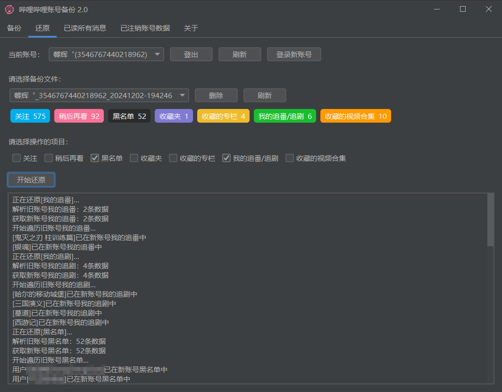
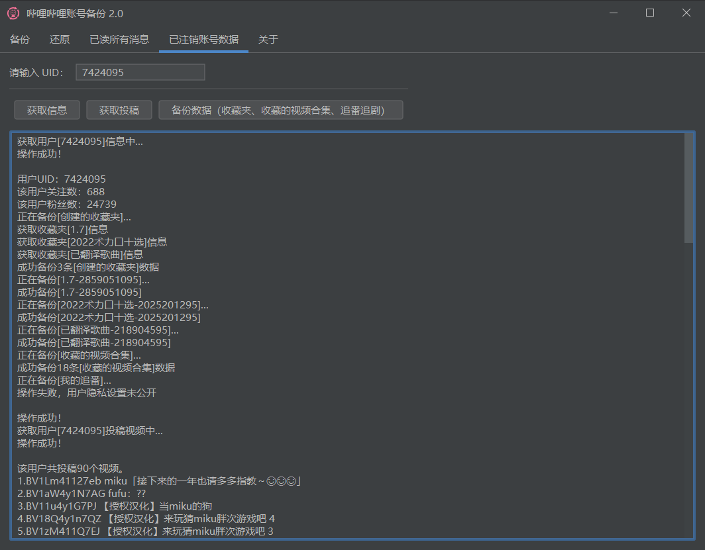

# 哔哩哔哩账号备份

[演示视频](https://www.bilibili.com/video/BV1gc1zY1EpV) 求点赞 T_T

一键对B站账号进行数据备份和还原，方便账号数据迁移/快速转生。

> 某些需要转生的原因：
>
> - 被某UP主拉黑，看不到他的动态/直播间
> - 重置直播间消费记录、消费等级？
> - 评论一直被删，重置阿瓦隆？（不确定是否可以）
> - 之前账号发布了一些言论？
> - 账号部分功能受限
> - ...（你来补充）

## 支持的平台

- Windows

（其他平台可以自己下载源码，配置参数后自己打包一下，详情请看：[JavaPackager](https://github.com/fvarrui/JavaPackager)）

## 具体功能

- 备份/还原
    - 关注和关注分组
    - 黑名单
    - 我的追番/追剧
    - 收藏夹
    - 收藏的专栏
    - 收藏的视频合集
    - 稍后再看
- 一键已读所有消息
- 查询已注销账号
  - 获取信息
      - 关注和粉丝数量
      - 投稿的视频
  - 备份数据
    - 收藏夹
    - 收藏的视频合集
    - 追番追剧

## 软件截图

## 下载使用

- [Github](https://github.com/hzhilong/bilibili-backup/releases/latest)

- [蓝奏云](https://ybgnb.lanzouj.com/b0016vm26f)，密码 `ybgnb`

## 注意事项

- 新号请先升到2级。
- 关注数过多的话，还原时可能会遇到风控，建议过段时间再继续还原。

## 感谢

- [bilibili-API-collect](https://github.com/SocialSisterYi/bilibili-API-collect)
- [FlatLaf](https://github.com/JFormDesigner/FlatLaf)  
