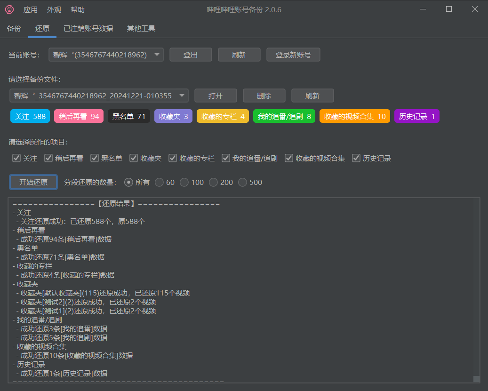

# 哔哩哔哩账号备份

[演示视频](https://www.bilibili.com/video/BV1gc1zY1EpV) 求点赞 T_T

一键对B站账号进行数据备份和还原，方便账号数据迁移/快速转生。

> 某些需要转生的原因：
>
> - 被某UP主拉黑，看不到他的动态/直播间
> - 重置直播间消费记录、消费等级？
> - 评论一直被删，重置阿瓦隆？（不确定是否可以）
> - 之前账号发布了一些言论？
> - 账号部分功能受限
> - 转卖游戏号，需要迁移数据，并且迁移后清空原账号数据
> - ...（你来补充）

## 支持的平台

- Windows

（mac/linux 可以自己下载源码编译，详情请看：[JavaPackager](https://github.com/fvarrui/JavaPackager)）

## 具体功能

- 备份/还原/清空
    - 关注和关注分组
    - 黑名单
    - 我的追番/追剧
    - 收藏夹
    - 收藏的专栏
    - 收藏的视频合集
    - 稍后再看
    - 历史记录
    - 粉丝（不支持还原）
- 查询已注销账号
    - 获取信息
        - 关注和粉丝数量
        - 投稿的视频
    - 备份数据
        - 收藏夹
        - 收藏的视频合集
        - 追番追剧
- 其他工具
  - 已读所有私信
  - 删除所有私信
  - 删除所有系统消息
  - 强制开启私信自动回复功能

部分备份还原项目支持分段处理，用于数据过多的情况。例如关注动不动就上千的 ( ﹁ ﹁ ) ~→

## 软件截图

## 下载使用

- [Github](https://github.com/hzhilong/bilibili-backup/releases/latest)

- [蓝奏云](https://ybgnb.lanzouj.com/b0016vm26f)，密码 `ybgnb`

## 注意事项

- 新号请先升到2级。
- 如果因为备份还原的数据过多而遇到风控，可尝试勾选分段处理。
- 还原时新账号数据过多的话，可勾选设置项【还原时忽略新账号现有的数据，直接还原】。
- 部分UP主可能无法关注，还原时会导致失败从而停止整个备份，可勾选设置项【关注还原失败时，继续还原下一个数据】。

## 感谢

- [bilibili-API-collect](https://github.com/SocialSisterYi/bilibili-API-collect)
- [FlatLaf](https://github.com/JFormDesigner/FlatLaf)  
